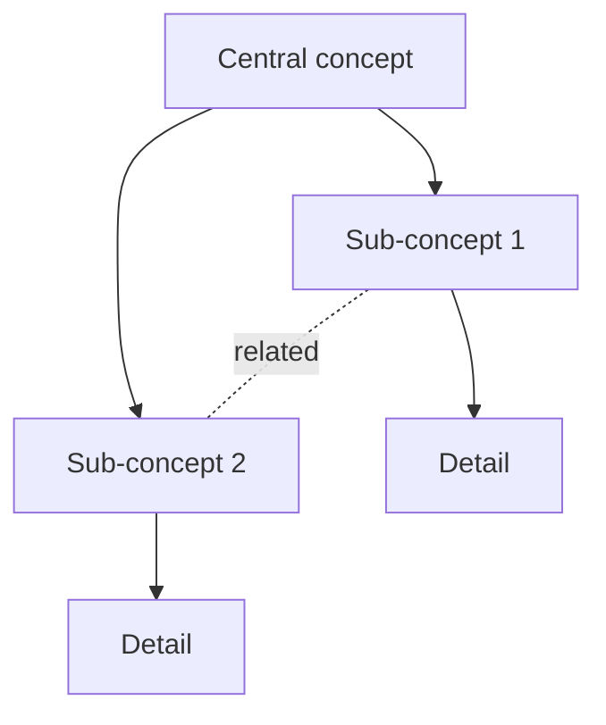

# Concept map: {{TOPIC_TITLE}}

Text fallback

<!-- Populate this list with the same nodes and edges as the Mermaid diagram above.
     Format: - Source Node → Target Node
     Both blocks must remain in sync — same nodes, same directed edges. -->

- {{Node A}} → {{Node B}}
- {{Node A}} → {{Node C}}

**Legend:** solid arrows = direct dependency, dotted lines = related.

## Linked pages

- Central: [[wiki/pages/{{TOPIC}}]]
- Sub-concepts: [[wiki/pages/...]]

## Notes

- Update when new concepts emerge.
- If the map grows past ~12 nodes, split into two views.
